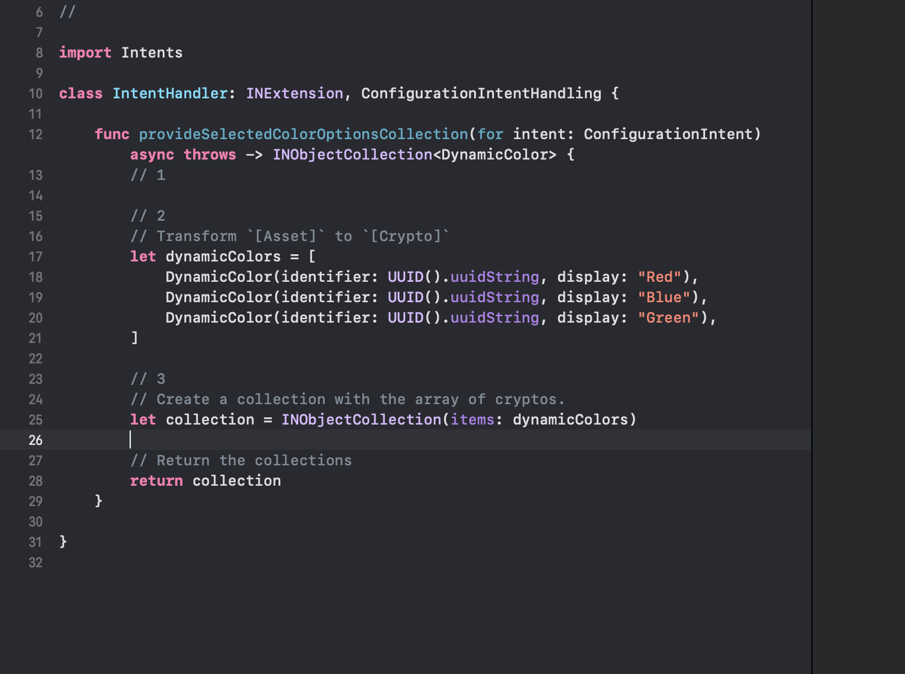
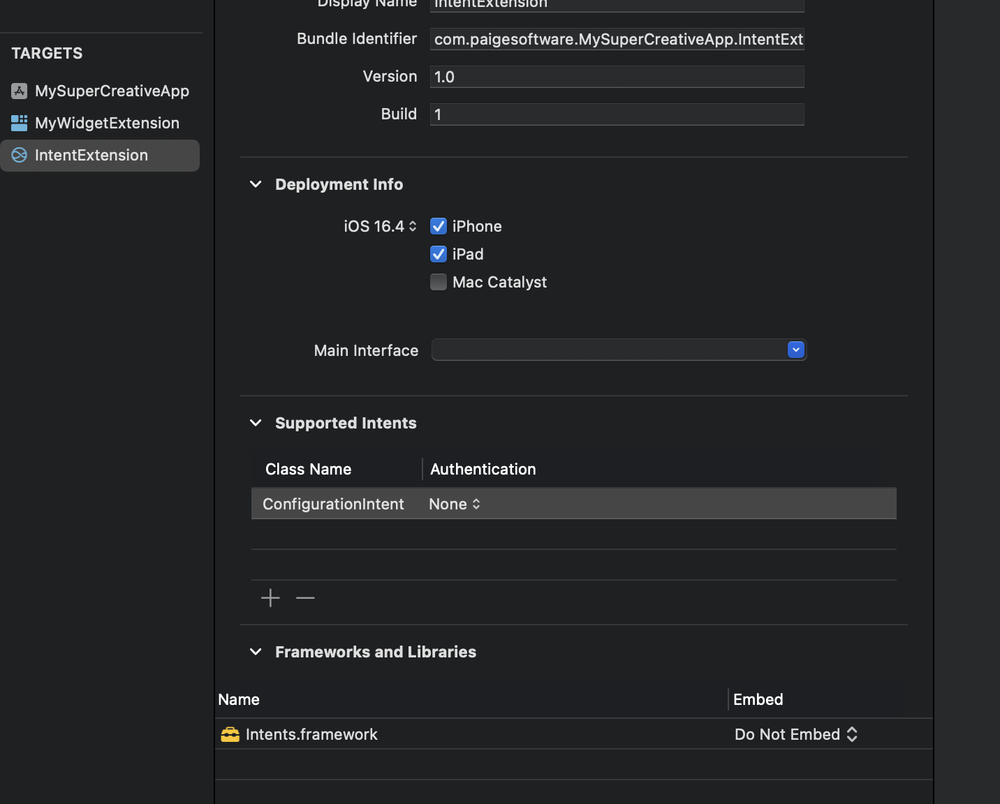
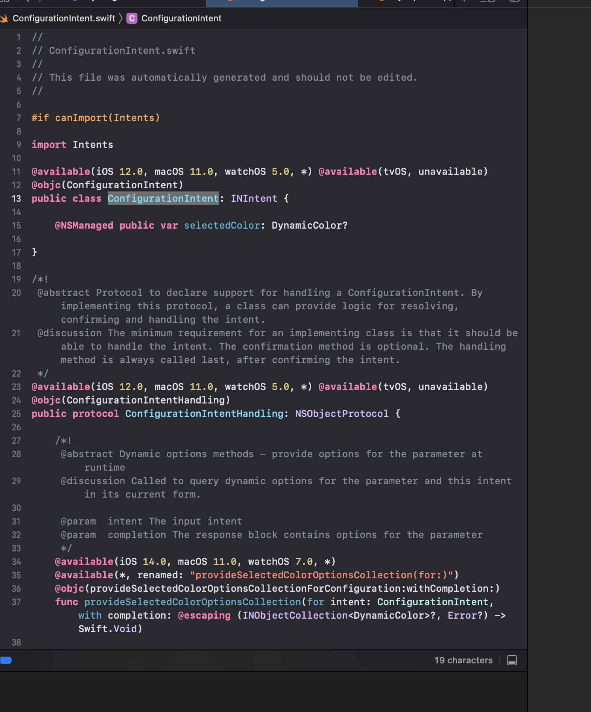
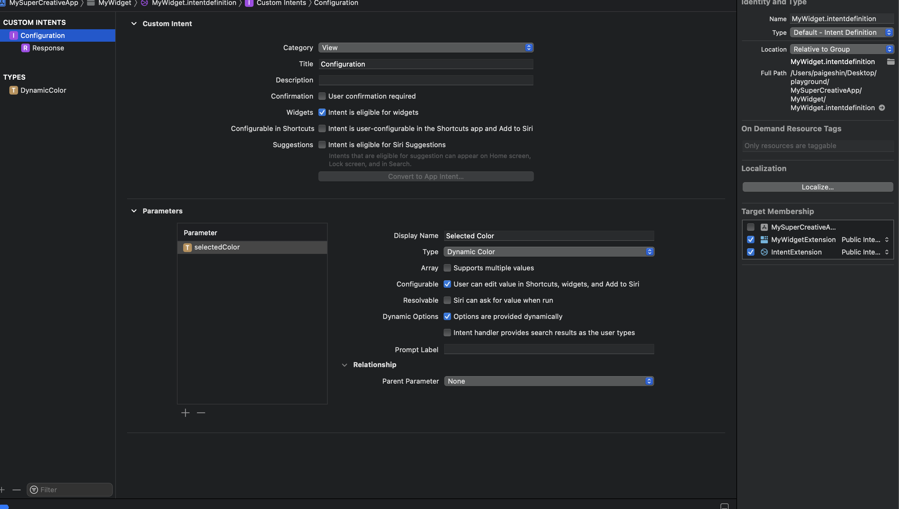

# intent_widget_with_enum

### Step by Step to create your own intent

1. Create Intent Definition File

2. Create Enum or Type

3. Create New Intent

   1) Set category to View(Information)
  
   2) Check "Intent is available for widgets"
  
   3) Uncheck "Intent is user-configurable in the Shortcust app and Add to Siri"
  
   4) Uncheck Intent is eligible for Siri Suggestions
  
4. Add parameter to your intent

   1) Set your type (enum or type you defined earlier)
  
   2) Uncheck "Siri can ask for value when run"
  
   3) Set default value of your own choice

### Source Code 

```swift
import WidgetKit
import SwiftUI

struct ExpenseEntry: TimelineEntry {
    public let date: Date
    public let category: ExpenseCategory
}

public enum ExpenseCategory: Int {
    case all = 1
    case food
    case grocery
    case gas
    case rent
    
    func description() -> String {
        switch self {
        case .all:
            return "All"
        case .food:
            return "Food"
        case .grocery:
            return "Grocery"
        case .gas:
            return "Gas"
        case .rent:
            return "Rent"
        }
    }
    
}


struct Provider: IntentTimelineProvider {

    public typealias Entry = ExpenseEntry

    func category(for config: ViewMonthlyExpenseIntent) -> ExpenseCategory {
        switch config.category {
        case .all: return .all
        case .food: return .food
        case .grocery: return .grocery
        case .gas: return .gas
        case .rent: return .rent
        default: return .all
        }
    }
    
    func placeholder(in context: Context) -> ExpenseEntry {
        let entry = ExpenseEntry(date: Date(), category: .all)
        return entry
    }
    
    func getSnapshot(for configuration: ViewMonthlyExpenseIntent, in context: Context, completion: @escaping (ExpenseEntry) -> Void) {
        let entry = ExpenseEntry(date: Date(), category: self.category(for: configuration))
        completion(entry)
    }
    
    func getTimeline(for configuration: ViewMonthlyExpenseIntent, in context: Context, completion: @escaping (Timeline<ExpenseEntry>) -> Void) {
        var entries: [ExpenseEntry] = []
        let currentDate = Date()
        for hourOffset in 0..<5 {
            let entryDate = Calendar(identifier: .gregorian).date(byAdding: .hour, value: hourOffset, to: currentDate)!
            let entry = ExpenseEntry(date: entryDate, category: self.category(for: configuration))
            entries.append(entry)
        }
        let timeline = Timeline(entries: entries, policy: .atEnd)
        completion(timeline)
    }

}

struct PlaceholderView: View {
    
    var body: some View {
        Text("Loading...")
            .redacted(reason: .placeholder)
    }
    
}

struct ExpenseWidgetEntryView: View {
    
    var entry: ExpenseEntry
    
    var body: some View {
        ExpenseView(category: self.entry.category)
    }
    
}

struct ExpenseView: View {
    
    let category: ExpenseCategory
    
    var body: some View {
        switch self.category {
        case .all:
            ZStack {
                Color.blue.opacity(0.6)
                VStack {
                    Text("Total Expense")
                    Text("$3,343")
                        .font(.title)
                    ZStack(alignment: .leading) {
                        RoundedRectangle(cornerRadius: 10)
                            .fill(.white.opacity(0.5))
                        RoundedRectangle(cornerRadius: 10)
                            .fill(.white.opacity(0.5))
                    } //: ZStack
                    .frame(height: 20)
                    .padding(.horizontal)
                } //: VStack
                .foregroundColor(.white)
            } //: ZStack
        case .food:
            ZStack {
                Color.blue.opacity(0.6)
                VStack {
                    Text("Food Expense")
                    Text("$2,432")
                        .font(.title)
                    ZStack(alignment: .leading) {
                        RoundedRectangle(cornerRadius: 10)
                            .fill(.white.opacity(0.5))
                        RoundedRectangle(cornerRadius: 10)
                            .fill(.white.opacity(0.5))
                    } //: ZStack
                    .frame(height: 20)
                    .padding(.horizontal)
                } //: VStack
                .foregroundColor(.white)
            } //: ZStack
        case .grocery:
            ZStack {
                Color.blue.opacity(0.6)
                VStack {
                    Text("Grocey Expense")
                    Text("$2,432")
                        .font(.title)
                    ZStack(alignment: .leading) {
                        RoundedRectangle(cornerRadius: 10)
                            .fill(.white.opacity(0.5))
                        RoundedRectangle(cornerRadius: 10)
                            .fill(.white.opacity(0.5))
                    } //: ZStack
                    .frame(height: 20)
                    .padding(.horizontal)
                } //: VStack
                .foregroundColor(.white)
            } //: ZStack
        case .gas:
            ZStack {
                Color.blue.opacity(0.6)
                VStack {
                    Text("Gas Expense")
                    Text("$2,432")
                        .font(.title)
                    ZStack(alignment: .leading) {
                        RoundedRectangle(cornerRadius: 10)
                            .fill(.white.opacity(0.5))
                        RoundedRectangle(cornerRadius: 10)
                            .fill(.white.opacity(0.5))
                    } //: ZStack
                    .frame(height: 20)
                    .padding(.horizontal)
                } //: VStack
                .foregroundColor(.white)
            } //: ZStack
        case .rent:
            ZStack {
                Color.blue.opacity(0.6)
                VStack {
                    Text("Rent Expense")
                    Text("$2,432")
                        .font(.title)
                    ZStack(alignment: .leading) {
                        RoundedRectangle(cornerRadius: 10)
                            .fill(.white.opacity(0.5))
                        RoundedRectangle(cornerRadius: 10)
                            .fill(.white.opacity(0.5))
                    } //: ZStack
                    .frame(height: 20)
                    .padding(.horizontal)
                } //: VStack
                .foregroundColor(.white)
            } //: ZStack
        }
    }
    
}

struct ExpenseWidget: Widget {
    
    private let kind: String = "ExpenseWidget"
    
    var body: some WidgetConfiguration {
        IntentConfiguration(
            kind: self.kind,
            intent: ViewMonthlyExpenseIntent.self,
            provider: Provider(),
            content: { entry in
                ExpenseWidgetEntryView(entry: entry)
            })
        .configurationDisplayName("Expense Widget")

    }
    
}

```


# Intent for Custom Type

https://swiftsenpai.com/development/configurable-widgets-dynamic-options/

### Custom Type Intent 

1. Define your custom type

   1) Define your parameter

      - Set type of your 
      - Check Options are provided dynamically
     
2. Set up the intents extension

3. In your custom intent, open the auto-generated class, copy it

4. Paste it as class name in supported intents (Target of your intents extension)

5. In your widget, add target membership for IntentExtension

6. In your custom intent, open the auto-generated class again to find out protocol

### Source Code 

```swift
func provideSelectedCryptoOptionsCollection(
    for intent: CryptoPriceConfigurationIntent
) async throws -> INObjectCollection<Crypto> {
    
    // 1
    // Fetch list of top ten crypto from API
    let assets = try await AssetFetcher.fetchTopTenAssets()
    
    // 2
    // Transform `[Asset]` to `[Crypto]`
    let cryptos = assets.map { asset in
        
        let crypto = Crypto(
            identifier: asset.id,
            display: "\(asset.name) (\(asset.symbol))"
        )
        crypto.symbol = asset.symbol
        crypto.name = asset.name
        
        return crypto
    }
    
    // 3
    // Create a collection with the array of cryptos.
    let collection = INObjectCollection(items: cryptos)
    
    // Return the collections
    return collection
}
```

7. Go to your Intent Extension and adopt `copied protocol` 


---








